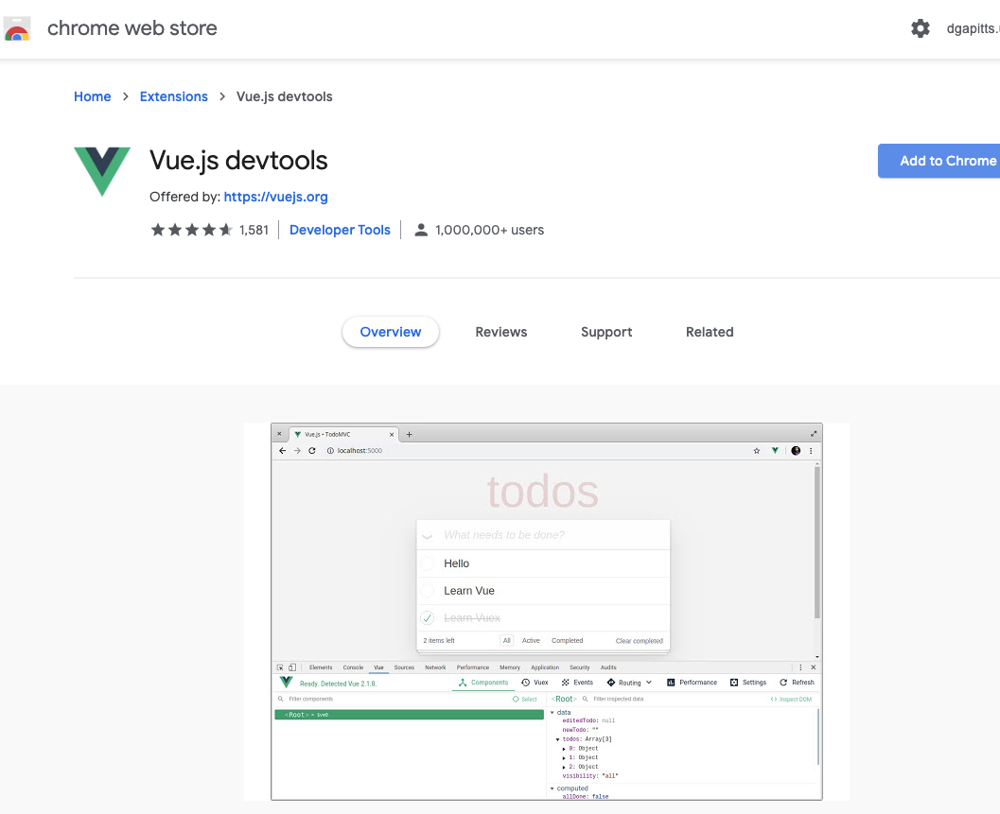
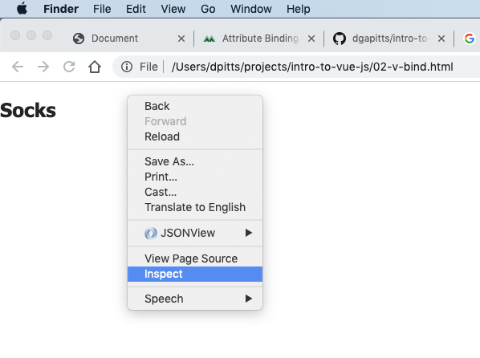
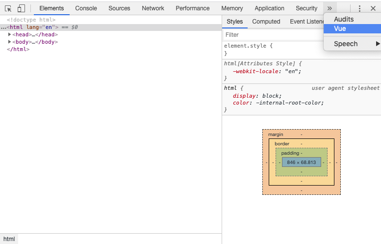
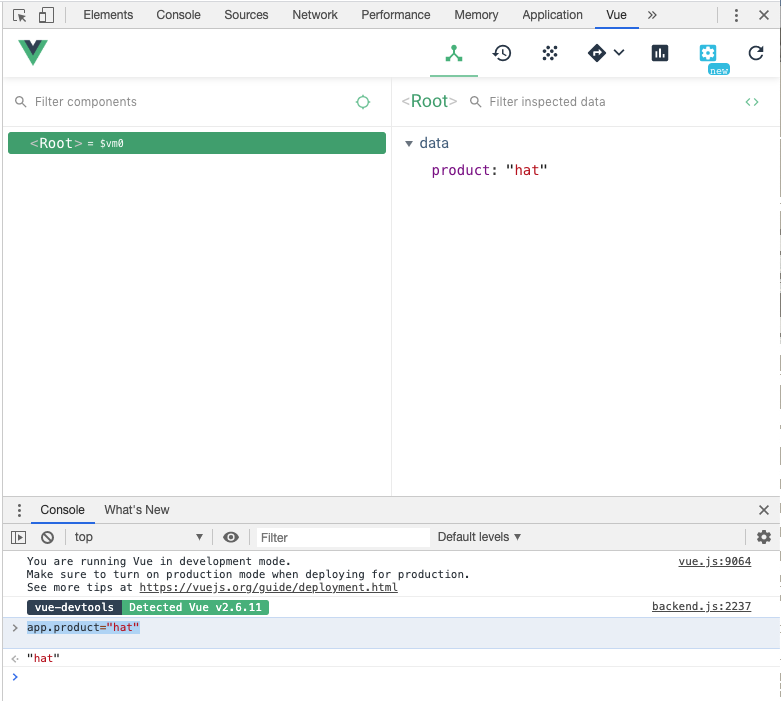

# intro-to-vue-js
My code and notes based on exercise from intro-to-vue-js course from https://www.vuemastery.com/

# Lesson 01 - intro and base setup


## Chrome installation of Vue.js chrome extenstion

### Installation

### Step 00 In chrome web store add extension Vue.js devtools

Goto https://chrome.google.com/webstore/category/extensions?hl=en and add extension Vue.js




### Step 01 Right click and select Inspect

### Step 02 Then switch to Vue

### Step 03 Now we can browse our data model and update in via the console


#### BACKGROUND NOTES - useful awk and sed commands when working with markdown

##### Replacing spaces with hyphons

It would have been sensible to have originally create my images with hyphons instead of spaces, but this easy enough to correct with a little help from awk and sed scripts
```
~/projects/intro-to-vue-js $ ls 01.*|sort
01.01 Right click and select Inspect.png
01.02 Then switch to Vue.png
01.03 Now we can browse our data model and update in via the console.png
```

maybe this is could be automated further but that seems too fiddly for a few files
```
~/projects/intro-to-vue-js $ ls *png|sed 's/ /-/g'
01.01-Right-click-and-select-Inspect.png
01.02-Then-switch-to-Vue.png
01.03-Now-we-can-browse-our-data-model-and-update-in-via-the-console.png
~/projects/intro-to-vue-js $ mv 01.01\ Right\ click\ and\ select\ Inspect.png 01.01-Right-click-and-select-Inspect.png
~/projects/intro-to-vue-js $ mv 01.02\ Then\ switch\ to\ Vue.png 01.02-Then-switch-to-Vue.png
~/projects/intro-to-vue-js $ mv 01.03\ Now\ we\ can\ browse\ our\ data\ model\ and\ update\ in\ via\ the\ console.png 01.03-Now-we-can-browse-our-data-model-and-update-in-via-the-console.png
```

##### generating image headers

```
~/projects/intro-to-vue-js $ ls *png|sed 's/-/ /g;s/.png//g;s/^01./### Step /g'
### Step 01 Right click and select Inspect
### Step 02 Then switch to Vue
### Step 03 Now we can browse our data model and update in via the console
```

##### generating image markdown

```
~/projects/intro-to-vue-js $ ls 01.*png|awk '{print ""}'


```


